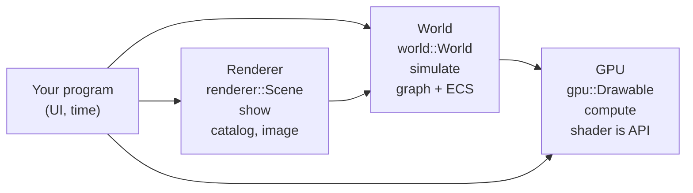

# Compages

[Compages](https://github.com/Lecrapouille/Compages) is a C++20 library offering a **three stacked layers** 3D engine, each stacked offering public surface small and intuitive to make in few line either GPU-side simulation or full interactive spatial scene or game at the layer your program actually needs. Each layer builds and runs without the one above it—unusual among monolithic 3D engines and all-in-one GL wrappers. Compages treats three layers:



1. **GPU** — abstract OpenGL layer in a [Glumpy](https://glumpy.github.io/) style: where **shaders** are the input and name the **data**, filling attributes, uniforms, and textures with those GLSL names on the CPU; `draw()` flushes to the GPU what changed on CPU, then draws. No manual location lookup in your code.
2. **World** — abstract spatial scene using graph and ECS (Entity Component System): in a [Three.js](https://threejs.org/) style: chain calls like Three.js (`m_world.entity("player").set(Position{}).set(Velocity{ { 1.0f, 0.0f, 0.0f } });`), iterate ECS components like (`each<Velocity>()`). This layer is the headless simulation graph itself: Meshes and draw calls live on the next layer.
3. **Renderer** — `Scene` wires camera, lights, primitives, and glTF into that world, snapshots it for drawing, and drives the GPU layer. Several scenes can share one `World`.

**Note:** Compages is the new name of OpenGLCppWrapper project that has been discontinued during several years because the three stacked layers architecture could be achieved (the library was not CPU cache friendly, slow OpenGL wrapper due to usage of virtual methods, renderer suffer of non interleaving data, material was difficult to use ...). The usage of LLMs make the project revival by fixing all these issues.

*Compages: Means an assemblage, a structure, an interlocking of several parts that together form a coherent whole.*

---

## Quick installation

You need a C++20 toolchain, Make, CMake, Git, and `pkg-config`. The current `GL45` backend targets OpenGL **4.5 core** (and is not compatible with MacOS).

```sh
git clone --recurse-submodules https://github.com/Lecrapouille/Compages.git
cd Compages
make download-external-libs
make compile-external-libs
make -j"$(nproc --all)"
```

A `build` folder shall have been created, owning the static and shared library and example standalone applicarion.

```sh
./build/Compages-examples
```

Optionaly you can install on your operation system:

```sh
sudo make install
```

For developpers, you can optionaly run unit tests:

```sh
make tests -j16
```

---

## Code at a glance

### Layer 1 — triangle from a shader

Inspired by [Glumpy](https://glumpy.github.io/): The entry point is GLSL (OpenGL shaders). You don't write any `glBindBuffer` calls or query attribute locations. Assignments update the CPU-side copy; calling `draw()` automatically flushes any modified data to the GPU. Here is the minimal example. Dirty positions and colors are automatically synced with the GPU.

```cpp
#include <Compages/GPU/GPU.hpp>

constexpr const char* VERTEX_SHADER = R"(
#version 450 core
in vec2 position;
in vec3 color;
out vec3 vColor;

void main()
{
    vColor = color;
    gl_Position = vec4(position, 0.0, 1.0);
})";

constexpr const char* FRAGMENT_SHADER = R"(
#version 450 core
in vec3 vColor;
out vec4 oColor;

void main()
{
    oColor = vec4(vColor, 1.0);
})";

gpu::Drawable triangle;

// Setup
COMPAGES_TRY(triangle.load(VERTEX_SHADER, FRAGMENT_SHADER));
triangle["position"] = { { -0.8f, -0.6f }, { 0.8f, -0.6f }, { 0.0f, 0.8f } };
triangle["color"]    = { { 1, 0, 0 }, { 0, 1, 0 }, { 0, 0, 1 } };
triangle.prepare();

// Draw
gpu::clear({ 0.1f, 0.1f, 0.15f });
triangle.draw();
```

The result will be:


Example: `examples/00_GettingStarted/01b_Triangle.cpp` · Guide: [doc/GPU.md](doc/GPU.md)

Have you seen so few lines of code for wrapping OpenGL? Evolved examples allow you to create galaxy simulation and getting results from GPU to CPU.

From the same shaders, a less naive version is:

```cpp
struct Vertex
{
    Vector2f position;
    Vector3f color;
};

gpu::Buffer<Vertex> vertices;
gpu::Drawable triangle:

COMPAGES_TRY(triangle.load(VERTEX_SHADER, FRAGMENT_SHADER));
const std::array<Vertex, 3u> corners{
    { { { -0.8f, -0.6f }, { 0.1f, 0.9f, 0.9f } },
    { { 0.8f, -0.6f }, { 0.9f, 0.1f, 0.9f } },
    { { 0.0f, 0.8f }, { 0.9f, 0.9f, 0.1f } } }
};

COMPAGES_TRY_ASSIGN(vertices,
    gpu::Buffer<Vertex>::from(corners, { .usage = gpu::BufferUsage::Immutable, .cpu_mirror = false })
);

triangle.vertices(vertices);
triangle.prepare();
```

La même porte mène aux simulations. Huit mille étoiles s’attirent dans un compute shader ; le drawable lit le buffer que le calcul vient d’écrire.


`13_Galaxy` · particules : `12_ComputeParticles` · [doc/GPU.md](doc/GPU.md).

`14_SpiralGalaxy` recreates the Glumpy galaxy: stars follow elliptical paths, and their color is sampled from a 1D texture.

### Layer 2 — world without a renderer

The world is built like a [Three.js](https://threejs.org/) scene: with named entities, parent-child relationships, and chained transforms. Simulation data is stored as C++ structs, which are iterated over in an ECS-like manner. `World::update` advances the simulation by one step. No OpenGL context is required.

```cpp
#include <Compages/World/Entity.hpp>

struct Velocity { Vector3f value; };

world::World world;
world::Entity ship = world.entity("Ship").set(Velocity{ { 1, 0, 0 } });
ship.child("Gun").position(0, 0.5f, 0);

world.each<Velocity>([](world::Entity e, Velocity& v) {
    e.position(e.position() + v.value);
});
world.update(frame);
```

Example: `examples/30_WorldAndAssets/30_HeadlessWorld.cpp` · Guide: [doc/World.md](doc/World.md)

### Layer 3 — picture of that world

Rendering the simulation or your game is still a nice to have. This is the task of the last layer:

```cpp
#include <Compages/Compages.hpp>

world::World world;
renderer::Scene scene(world);

scene.camera().position(0, 2, 6).add<world::Orbit>();
scene.sun();
scene.box("Cube", compages::renderer::color(0.9f, 0.18f, 0.12f));

// Or more complex:
// scene.box("Crate", renderer::texture("wooden-crate.jpg")).add<Spin>(1.0f);

scene.draw(frame);
```

The result will be:


Example: `examples/50_Complete/50_ThreeJsLike.cpp` · Guide: [doc/Renderer.md](doc/Renderer.md)

---

## Documentation

| Document | Contents |
|----------|----------|
| [doc/README.md](doc/README.md) | Reading order, beginner → advanced |
| [doc/Philosophy.md](doc/Philosophy.md) | Design intent; Glumpy, Three.js, Bevy |
| [doc/Architecture.md](doc/Architecture.md) | Layers, includes, frame flow, `src/` layout |
| [doc/Tutorial.md](doc/Tutorial.md) | Three full programs (GPU, World, Renderer) |
| [doc/GPU.md](doc/GPU.md) | Layer 1: Drawable, buffers, compute, multi-pass |
| [doc/World.md](doc/World.md) | Layer 2: graph, ECS, joints, behaviors |
| [doc/Renderer.md](doc/Renderer.md) | Layer 3: Scene, assets, extraction, animation |
| [doc/CheatSheet.md](doc/CheatSheet.md) | Compact API reference |
| [doc/Examples.md](doc/Examples.md) | Annotated gallery and screenshots |
| [doc/Install.md](doc/Install.md) | Ubuntu, Fedora, macOS, install, pkg-config |
| [doc/Debug.md](doc/Debug.md) | KHR_debug, apitrace, RenderDoc |
| [doc/Credits.md](doc/Credits.md) | History, inspirations, third parties |

---

## License

GNU General Public License v3. See source headers and [doc/Credits.md](doc/Credits.md).
