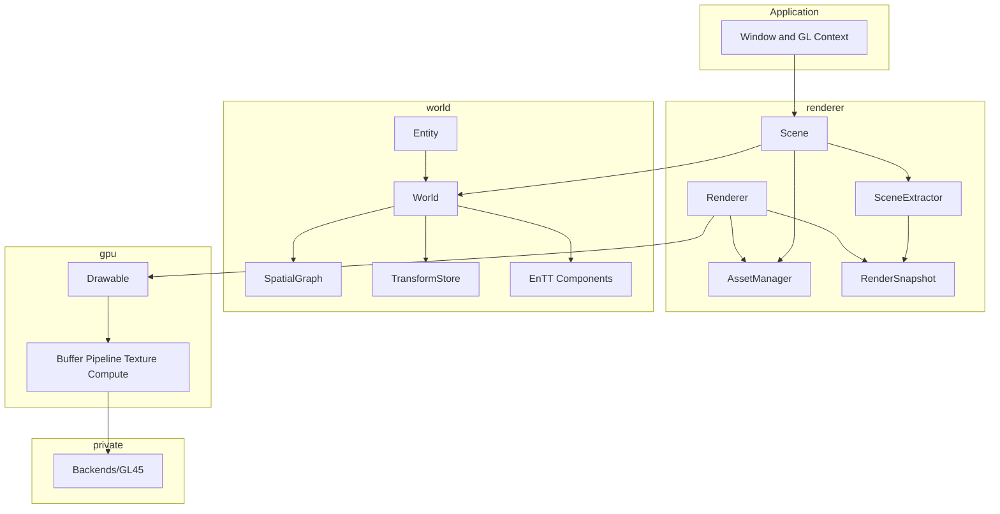

# Architecture

Compages organizes the repository into **three layers** with a shared vocabulary. Each layer exposes a minimal entry point. The rest of the public API supports cases already covered by the examples gallery.

The *why* can be found in [Philosophy.md](Philosophy.md). This page explains *where* the code lives, *who can include whom*, and *what happens* during a frame.

## Overview



`src/Core/` (vectors, matrices, `Result`, files) is the shared vocabulary. It is not a fourth product layer: no simulation or draw ever starts from there.

## Inclusion Hierarchy

| Layer | Entry Point | May Include | Does Not Include |
|-------|-------------|-------------|------------------|
| `compages::gpu` | `Drawable` | `Core` | `World`, `Renderer`, any `gl*` |
| `compages::world` | `World`, `Entity` | `Core` | `GPU`, `Renderer` |
| `compages::renderer` | `Scene` | `World`, `GPU`, `Core` | windowing code |

```cpp
#include <Compages/Compages.hpp>       // full stack
#include <Compages/GPU/GPU.hpp>        // layer 1
#include <Compages/World/World.hpp>    // ids, each, update
#include <Compages/World/Entity.hpp>   // chaining
#include <Compages/Renderer/Scene.hpp> // layer 3
```

The only code that includes glad is `src/GPU/Backends/GL45/`. The `GPU_BACKEND` variable in `Makefile.common` selects which backend directory is compiled. Callers of `gpu::` don't need to change anything.

## Directory Structure

```text
include/Compages/          public interface, to be installed
  Core/                    vectors, matrices, Result, Frame
  GPU/                     Drawable, Buffer, Compute, Texture…
  World/                   World, Entity, Behaviors, joints, controllers
  Renderer/                Scene, assets, extraction, rendering
src/
  Core/                    File.cpp
  GPU/                     implementation + Backends/GL45/
  World/                   World, Entity, Spatial/, Controllers/
  Renderer/                Scene, Assets/, Render/, Systems/
examples/                  gallery, one binary
tests/                     GPU, World, Renderer
attic/Physics/             ReactPhysics3D adapter, not part of the main build
external/manifest          list of third-party repositories
```

`include/` is the contract. `src/` is not installed.

## GPU Layer

Model: an OpenGL program consists of a shader with named data. `Drawable::operator[]` and `vertices<T>()` fill the CPU mirror. Calling `draw()` flushes any DirtyRanges, then submits the draw call.

Close to the entry point, for demos that need them:

| Type | Role |
|------|------|
| `Buffer<T>` | CPU mirror, SSBO, shared between compute/draw |
| `Pipeline`, `Program` | one mesh, multiple shaders |
| `Texture`, `Framebuffer`, `RenderPass` | targets, post-process |
| `ComputeProgram`, `barrier` | compute grids |
| `UniformBlock` | uniform blocks shared between passes |

Handles are managed via pools (index + generation). Double destruction is harmless. `Buffer<T>` is non-copyable.

## World Layer

1. **Graph** — `SpatialGraph` (parent, first child, sibling), `TransformStore` (local, world, dirty bit). Parent → child propagation.
2. **ECS** — EnTT. `Entity` is the fluent interface; `EntityId` is what gets stored.

`World::update(Frame)` executes all `Behaviors`; then, calling `update()` without argument runs articulations (`KinematicSystem`), and finally computes matrices (`TransformSystem`).

`Orbit` and `Fly` are behaviors in `World/Controllers/Controls.hpp`, using `ViewFrame`. `FPSController` is a separate class—it's used via `apply`, and doesn't perform drawing itself.

## Renderer Layer

Three main jobs live under `Scene`:

| Task | Classes |
|------|---------|
| Asset Catalog | `AssetManager`, glTF/STL/URDF loaders |
| Instantiation | `load`, `instantiate`, prefabs |
| Frame Rendering | `SceneExtractor` → `RenderSnapshot` → `Renderer` |

```text
Scene::draw(ViewFrame)
  Scene::update
    World::update(frame)
    AnimationSystem
    World::update()
    skinning on SkinInstance
  Scene::render
    SceneExtractor
    Renderer  →  gpu::
```

`scene.box(...)` returns a `world::Entity`. Layer 2 continues beneath layer 3.

## Four Actors per Frame

```text
application    context, input, ViewFrame
world          entities, behaviors, joints, matrices
renderer       rendering, asset id resolution
gpu            flushes CPU to backend, draw and dispatch
```

- `world::Frame` — time and size. Headless simulation.
- `world::ViewFrame` — `Frame` plus input.

## Where to Enter the Codebase

| Goal | File | Demo |
|------|------|------|
| Triangle | `GPU/Drawable.hpp` | `01b_Triangle` |
| Compute | `GPU/Compute.hpp` | `12_ComputeParticles` |
| Headless world | `World/World.hpp` | `30_HeadlessWorld` |
| Joints | `World/Spatial/Joint.hpp` | `38_RobotArm` |
| Scene | `Renderer/Scene.hpp` | `50_ThreeJsLike` |
| Extraction | `Renderer/Render/SceneExtractor.hpp` | Renderer tests |
| Assets | `Renderer/Assets/` | `34_GltfModel` |

## Windowing

GLFW exists only in `examples/Common/Window.cpp`. After ImGui drawing in the gallery, `gpu::forgetRenderState()` resets the backend's state to match the context.

## Physics

`attic/Physics/` is a ReactPhysics3D adapter, excluded from the main build. The intended outcome is for this to provide `world::` components and a system. The renderer would display the result; it would not simulate collision.

## Build

Package and install details are covered in [Install.md](Install.md).

```text
make download-external-libs
make compile-external-libs
make -j"$(nproc)"
make -C tests -j"$(nproc)"
```
