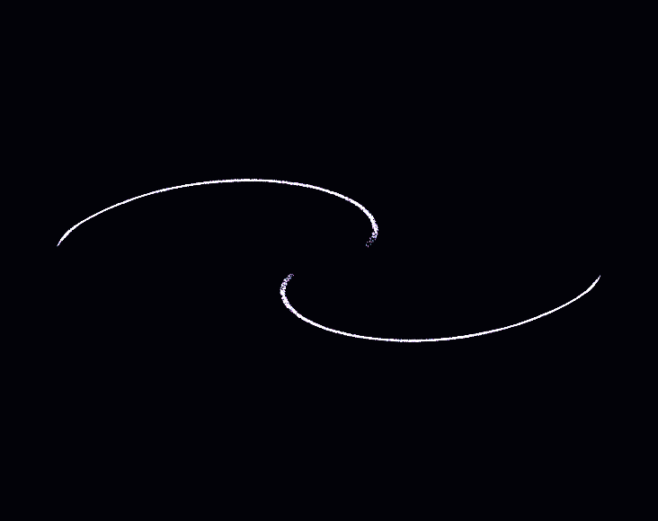

# Gallery

A single binary, `Compages-examples`, contains all the demos: viewport, list, inspector, source, console, GPU leak tests. It serves as the project's executable manual.

```sh
make -j"$(nproc)"
./build/Compages-examples
./build/Compages-examples 01b_Triangle
./build/Compages-examples --check
```

The sources are designed to be read in the order of the folders. Each `description()` explains the concept added. A short guide for `examples/` is available at [examples/README.md](../examples/README.md).

## Window

The viewport renders the demo into a texture: the panels do not crop the image.

| Key         | Action                                  |
|-------------|-----------------------------------------|
| PgUp / PgDn | previous / next demo                    |
| F1          | toggle panels                           |
| F2          | wireframe mode                          |
| F5          | restart                                 |
| F6 / F7     | pause / step one frame                  |
| F12         | save PNG of viewport in `screenshots/`  |
| Shift+F12   | save the window with its panels         |
| Escape      | release mouse (games) or quit           |

`--check` runs each demo for a few frames and fails if any GPU handle remains. `--cycle` cycles automatically, for a second screen. `--shots DIR` saves a PNG for each demo, and is used together with `--check` or `--cycle`.

```sh
./build/Compages-examples --check \
    --shots external/Compages-data/doc/examples
```

The six images already in `doc/images/` illustrate the README without requiring asset cloning. The above command populates the [Compages-data](https://github.com/Lecrapouille/Compages-data) repository.

```sh
make -C examples check-contracts
```

Checks that the manifest (`examples/Common/ExampleManifest.hpp`) and the pedagogical line budgets match the sources. The manifest is the definitive list; `main.cpp` is not.

## Legend

| Folder                                      | Layer Progression                 |
|----------------------------------------------|-----------------------------------|
| `00_GettingStarted/`, `10_ScientificAndCompute/` | GPU                              |
| `20_Performance/`                           | GPU, then renderer (for cubes)    |
| `30_WorldAndAssets/`                        | World, then World + Renderer      |
| `50_Complete/`                              | All three, up to a game           |

`30_HeadlessWorld` finishes before any `Scene` code runs.

---

## 00 — Getting Started

| Demo              | Concept                                      |
|-------------------|----------------------------------------------|
| `00a_Dummy`       | gallery cycle, zero GPU resources            |
| `00b_CpuGpuSync`  | CPU copy, orange bars = not yet sent         |
| `00c_Compute`     | a computation, `download()` brings numbers back |
| `01a_ClearScreen` | `clear` and two passes, no shaders           |
| `01b_Triangle`    | `Drawable`, data by name                     |


| Demo                   | Concept                                       |
|------------------------|-----------------------------------------------|
| `01c_InterleavedTriangle` | `Vertex` struct, immutable buffer           |
| `02_DynamicGeometry`      | dirty vertex follows the mouse              |
| `03a_TexturedQuad`        | `quad["image"] = texture`                   |
| `03b_MultiTextureBlend`   | five textures, blend map painted with mouse |
| `04_DepthAndTransforms`   | indices, depth, culling, three matrices     |
| `05a_MultiPassMesh`       | one `Buffer<Vertex>`, three pipelines       |
| `05b_RenderToTexture`     | off-screen cube, two readings of texture    |
| `05c_PostProcess`         | off-screen scene, fullscreen pass           |
| `06a_Mandelbrot`          | no VBO, uses `gl_VertexID`                 |
| `06b_ComplexShader`       | long shader on a quad                       |
| `07_PointClouds`          | sphere rendered with `GL_POINTS`            |

## 10 — Scientific and Compute

| Demo              | Concept                                           |
|-------------------|--------------------------------------------------|
| `10a_HeightMap`   | a hundred thousand heights recalculated on CPU    |
| `10b_Terrain3D`   | island colored by a 3D texture (water to snow)   |
| `11a_GameOfLife`  | one cell = one pixel, two ping-pong textures     |
| `11b_GrayScott`   | same ping-pong, with floats                      |
| `12_ComputeParticles` | compute writes buffer, draw reads it         |


| Demo            | Concept                                  |
|-----------------|------------------------------------------|
| `13_Galaxy`     | eight thousand stars, tiles in shared memory |



| Demo             | Concept                                                    |
|------------------|-----------------------------------------------------------|
| `14_SpiralGalaxy`| density waves: blackbody ramp, point sprite               |
| `15_Lorenz`      | curve grows; only the addition is sent                     |

## 20 — Performance

| Demo             | Concept                                                 |
|------------------|--------------------------------------------------------|
| `20a_SpriteBatch`| a hundred thousand sprites, one draw, instanced data   |
| `20b_ManyCubes`  | 1,728 cubes, one mesh, sorted by appearance, culling   |
| `21_IndirectDraw`| compute writes survivors and draw command; CPU doesn't read the count |

## 30 — World and Files

| Demo                | Concept                                     |
|---------------------|---------------------------------------------|
| `30_HeadlessWorld`  | ECS and behavior, no rendering              |


| Demo                | Concept                                     |
|---------------------|---------------------------------------------|
| `31_MovingRobot`    | boxes attached by joints, `Walk` behavior   |
| `32a_SplitViews`    | one world, two cameras, one update step     |
| `32b_CameraPick`    | orbit or fly, click to select               |
| `32c_MiscLookAt`    | a thousand cones look at a sphere           |
| `33a_TexturedSpheres` | color, photo, and tinted photo            |
| `33b_TextureGallery`  | nine images from the assets repository    |
| `33c_GeometryShowcase`| primitives: lit, textured, with depth, normals |
| `34_GltfModel`        | `Duck.glb`, `frameAll`                    |
| `35_PrefabAndSave`    | three copies, then JSON of asset names     |
| `36a_AnimatedModel`   | hips and shoulders as joints               |
| `36b_GltfAnimation`   | animation clips from `Soldier.glb`         |
| `37_Skybox`           | six faces, sky rotates with the camera     |
| `38_RobotArm`         | URDF IRB 2400, forward kinematics          |

Demos using files require you to run `make download-external-libs` (repository `Compages-data`).

## 50 — Complete

| Demo               | Concept                                              |
|--------------------|-----------------------------------------------------|
| `50_ThreeJsLike`   | shape, camera, light, one draw per frame            |


| Demo           | Concept                                                       |
|----------------|--------------------------------------------------------------|
| `51_Behaviors` | three cubes, three behaviors, press Space for the green one  |
| `52_MvpDemo`   | falling cubes, lamp, debug boxes                             |
| `53_DoomLike`  | the game: glTF, particles, fog, two levels                   |


Click to capture the mouse. WASD or arrow keys to move, Shift to run, Q and E to rotate, left click to shoot, R to reload, F to toggle the pointed torch, L to toggle the lantern. The green light exits the level.

## Window and ImGui

Only `examples/Common/Window.cpp` communicates with GLFW. The library receives a pre-created context.

The gallery draws its panels with ImGui (the `docking` branch as noted in the manifest). After drawing, `gpu::forgetRenderState()` prevents ImGui state from being mistaken for the demo's state.

## Physics

The old contact demos are in `attic/Physics/`, not included in the binary. See [Architecture.md](Architecture.md).
