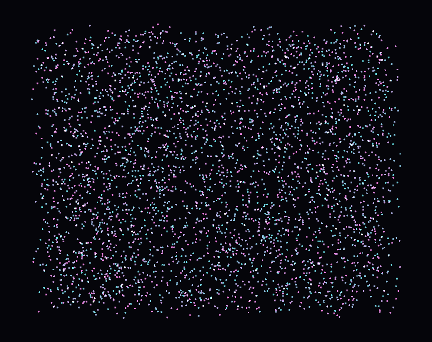

# First layer — GPU Layer

The first layer speaks **shader**. You write GLSL, fill in data using the names declared in the shader, and call `draw()`. This is inspired by [Glumpy](https://glumpy.github.io/), with a C++ vertex layout when the same mesh is used across several programs.

**Public interface:** `compages::gpu::Drawable`.
**Header:** `<Compages/GPU/GPU.hpp>`.
**Code:** `include/Compages/GPU/`, implementation in `src/GPU/`.
**Outside this layer:** window, entities, scene files.

The commented triangle program can be found in [Tutorial.md](Tutorial.md). This page explains what the triangle involves, then describes the cases where `Drawable` alone isn’t enough.



## Creating the Device

```cpp
#include <Compages/GPU/GPU.hpp>

if (auto ready = compages::gpu::init(glfwGetProcAddress); !ready)
    return fail(ready.error());

compages::gpu::shutdown();
```

`init` loads the OpenGL functions. The 4.5 core context must already be current.

## The Naming Contract

```cpp
compages::gpu::Drawable mesh;
COMPAGES_TRY(mesh.load(vertex_src, fragment_src));

mesh["position"] = positions;                  // attribute, one vector per vertex
mesh["tint"]     = Vector3f{ 1, 0.5f, 0.2f };  // uniform
mesh["image"]    = texture;                    // sampler; texture must outlive the drawable
mesh["time"]     = elapsed;

compages::gpu::clear({ 0.08f, 0.09f, 0.12f });
mesh.draw();
```

`operator[]` does not guess the type: the shader has already classified each name as an attribute, uniform, or sampler ("position", "tint", "image", "time"). The same syntax works for all three.

When vertices are assigned attribute by attribute, they are **reassembled interleaved** (position, color, position, color…). This is the layout the GPU reads most efficiently.

Assigning to an attribute marks a range as dirty. `draw()` only uploads that range. In `02_DynamicGeometry`, the top vertex is moved: only one vertex out of three is sent across the bus. `00b_CpuGpuSync` demonstrates the same idea on a raw `Buffer`, with orange bars representing parts the GPU doesn’t know yet—there the upload is done explicitly with `upload()`, since you manage the buffer yourself.

Uniforms are written per frame. A texture is assigned a unit and is only bound for drawing.

## Typed Vertices

When your data is already in a struct, field names must match the attribute names:

```cpp
struct Vertex { Vector2f position; Vector3f color; };

mesh.vertices<Vertex>({
    { { -0.8f, -0.6f }, { 1, 0, 0 } },
    { {  0.8f, -0.6f }, { 0, 1, 0 } },
    { {  0.0f,  0.8f }, { 0, 0, 1 } },
});

mesh.vertex<Vertex>(2u).position.y = 0.5f;   // marked dirty, sent at next draw
```

A buffer that will not change can be created as immutable, without a CPU mirror (`01c_InterleavedTriangle`):

```cpp
COMPAGES_TRY_ASSIGN(vertices,
    compages::gpu::Buffer<Vertex>::from(corners,
        { .usage = compages::gpu::BufferUsage::Immutable, .cpu_mirror = false }));
mesh.vertices(vertices);
```

The drawable reads this buffer where it is; it does not copy it.

## Errors

| When                             | Mechanism                                      |
|-----------------------------------|------------------------------------------------|
| Shader fails to compile           | `Result` / `COMPAGES_TRY` on `load`            |
| Unknown name, wrong type, empty draw | frame message                                |

```cpp
const std::string err = compages::gpu::takeFrameError();
```

`takeFrameError()` returns an empty string if nothing happened. Only the first message is kept; `frameErrorCount()` tells you how many errors followed. Calling `prepare()` at the end of setup triggers these checks before the main loop. `setBreakOnError(true)` causes the debugger to break on the offending line.

## When Drawable Isn’t Enough

| Need                                  | Types                                   | Demo                        |
|----------------------------------------|-----------------------------------------|-----------------------------|
| One mesh, several shaders              | `Buffer<Vertex>`, `Pipeline`, `Program` | `05a_MultiPassMesh`         |
| Offscreen rendering                    | `Framebuffer`, `RenderPass`, `Texture`  | `05b_RenderToTexture`, `05c_PostProcess` |
| Automation on an image                 | two `Texture`, swap                     | `11a_GameOfLife`, `11b_GrayScott` |
| Compute writes vertices                | `ComputeProgram`, `Buffer`, `barrier`   | `12_ComputeParticles`, `13_Galaxy` |
| CPU does not count survivors           | compute → indirect command              | `21_IndirectDraw`           |
| Heightfield on CPU                     | dynamic vertices, fixed indices         | `10a_HeightMap`, `10b_Terrain3D`  |

`05a_MultiPassMesh` is the milestone. A single `Buffer<Vertex>`, three programs (lighting, normals, wireframe). Each `Pipeline::create<Vertex>` checks the shader can read this struct. An attribute dropped by the linker is accepted. A type mismatch is not.

So, the layout is declared **on the C++ side**. The shader does not infer it for you, and you don’t redeclare it by hand with `glVertexAttribPointer`.

## Compute

A compute shader doesn’t process pixels: you give it a grid. The same `Buffer` can be the storage block it writes and the vertex data for the next draw. No CPU copy is needed. This is the purpose of `12_ComputeParticles`.

```cpp
COMPAGES_TRY(step.dispatchItems(count));
compages::gpu::barrier(compages::gpu::Barrier::VertexAttrib);
points.draw();
```

`barrier` is not automatically inserted after `dispatch`. The device is allowed to get ahead. Forgetting the barrier causes a race condition, not a compile error. You combine flags with `|`: `VertexAttrib`, `Storage`, `Command`, `All`, etc. (see `GPU/Core/Enums.hpp`).

`13_Galaxy` pushes the same concept: two ping-pong buffers, eight thousand stars, work group memory tiles. `00c_Compute` is the tiny sibling: an array of numbers, a `download()` to bring the result back to the CPU. In the demo, orange bars remain visible as long as the CPU copy lags behind.

`14_SpiralGalaxy` is the other galaxy, inspired by Glumpy. No gravity: ellipses whose tilt depends on radius. Temperature is a coordinate in a 1D texture—the blackbody ramp. The point is a sprite, blending is additive. Each frame, only position and size are rewritten; `draw()` sends whatever is dirty.

## Passes and State

- `gpu::clear(color)` clears the current target.
- `RenderPass` sets viewport, clears, and determines the target (framebuffer or window). `01a_ClearScreen` opens two passes—one for each window half—without a shader.
- `drawable.state().depth_test = true` (plus blending, culling, primitive) is owned by the drawable. The pipeline is only rebuilt if the state changes. `04_DepthAndTransforms` uses this for depth test and back-face culling.
- `gpu::forgetRenderState()` is called after a third party (ImGui, in the gallery) touches the context. The backend’s optimistic state is made honest again.

Driver messages (`KHR_debug`) are printed to stderr: `[gpu] warning:` and `[gpu] error:`. See [Debug.md](Debug.md).

## Handles

Driver objects live in pools: index plus generation. Double-destroy has no effect. You do not copy a `Buffer<T>`. The gallery `--check` verifies that closing a demo brings all counters back to zero: destroying the example is enough; you do not need to write a `tearDown()`.

## Gallery Walkthrough

Read in order. Each demo introduces a new idea.

1. `00b_CpuGpuSync` — CPU copy, pending range.
2. `00c_Compute` — a calculation, a data retrieve.
3. `01b_Triangle` then `01c_InterleavedTriangle` — by name, then by struct.
4. `02_DynamicGeometry` — a dirty vertex.
5. `04_DepthAndTransforms` — indices, depth, matrices.
6. `05a_MultiPassMesh` — one buffer, three readers.
7. `06a_Mandelbrot` — no VBO, just `gl_VertexID`.
8. `11a_GameOfLife` → `12_ComputeParticles` → `13_Galaxy` → `14_SpiralGalaxy`.

A commented list is in [Examples.md](Examples.md).

## Further Reading

- [World.md](World.md) — placing objects without the GPU.
- [CheatSheet.md](CheatSheet.md) — the quick reference table.
- [Architecture.md](Architecture.md) — where the backend lives.
