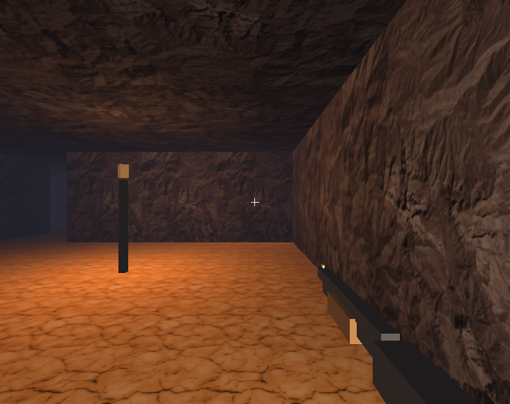

# Third layer — Renderer Layer

The third layer turns a `world::World` into an image: camera, lights, materials, meshes, animations, sky. The main entry point is `compages::renderer::Scene`. Under the hood: an asset catalog, a snapshot of the world, then `gpu::` calls.

**Header:** `<Compages/Compages.hpp>` (the stack) or `<Compages/Renderer/Scene.hpp>`.
**Code:** `include/Compages/Renderer/`, `src/Renderer/`.

The 10-line cube example is annotated in [Tutorial.md](Tutorial.md). This page describes the frame cycle, file structure, and demos that build on each other.


## Creating a Scene

```cpp
#include <Compages/Compages.hpp>

compages::world::World world;
compages::renderer::Scene scene(world);

scene.background(0.04f, 0.05f, 0.08f);
scene.camera().position(0.0f, 1.0f, 3.0f).add<compages::world::Orbit>();
scene.sun();
compages::world::Entity cube =
    scene.box("Cube", compages::renderer::color(0.9f, 0.18f, 0.12f));

COMPAGES_TRY(scene.prepare());
scene.draw(frame);
```

`box`, `sphere`, `plane`, `cylinder`, `cone`, and `pyramid` each return a `world::Entity`. You can chain calls like `.position()`, `.add<Spin>()`, `.rotate()` just like any other entity. The mesh and material are renderer components, invisible unless you include this layer.

`prepare()` uploads built objects to the GPU and returns the first construction error (missing image, internal shader, etc.). Construction errors don’t break execution—they are stored for this return value.

### Appearance

```cpp
compages::renderer::color(r, g, b);      // lit color
compages::renderer::texture("file.jpg"); // lit, tinted by color (white by default)
compages::renderer::normals();           // normals as color
compages::renderer::depth(near, far);    // distance, black to white
```

`33c_GeometryShowcase` aligns the primitives using these four modes. `33a_TexturedSpheres` shows: color, photo, and tinted photo.

Assets are searched under `external/Compages-data/` and `external/Compages-data/`, or via `COMPAGES_DATA_PATH` (`examples/Common/DataPath.hpp`).

## A Frame in Detail

```text
Scene::draw(ViewFrame)
  update
    World::update(frame)     behaviors
    AnimationSystem          clips → local transforms
    World::update()          joints/articulations, world matrices
    skinning                 SkinInstance
  render(active camera)
    SceneExtractor           World → RenderSnapshot
    Renderer                 snapshot + catalog → gpu::
```

Sorting is by material, then mesh, to minimize pipeline changes. Culling occurs during extraction, before the snapshot: `20b_ManyCubes` (1,728 cubes, one mesh, five appearances) demonstrates this by monitoring draw call counts while the camera moves.

Call `update` once, then `render` for each view:

```cpp
compages::renderer::Scene map(world, scene.assets());
compages::world::EntityId top = map.camera().id();

scene.update(frame);
scene.render();          // active camera
map.render(top);         // minimap, same world, same catalog
```

`32a_SplitViews`: orbit perspective left, orthographic top-down right. A camera whose viewport is only a part of the image will clear and draw only that region.

## Asset Catalog, Files, and Prefabs

| Call                          | Effect                                                      |
|-------------------------------|-------------------------------------------------------------|
| `scene.load("Duck.glb")`      | loads and places in the world; returns the root entity      |
| `scene.assets().load(path)`   | returns a `PrefabId`, does not affect the world            |
| `scene.instantiate(prefab)`   | adds a copy; joints are remapped                           |
| `scene.frameAll()`            | places camera/sun to see everything; returns center, for `Orbit` |
| `scene.play(model, "Walk")`   | plays an animation from the file                           |
| `scene.clips(model)`          | lists available clip names, in file order                  |

Formats supported by `load`: glTF / GLB, saved prefab, STL mesh, robot URDF. URDFs come with their own joints (`38_RobotArm`).

`34_GltfModel` loads `Duck.glb` and frames the camera. `36b_GltfAnimation` plays clips from `Soldier.glb` (keys 1, 2, 3 in the demo). `35_PrefabAndSave` instantiates a prefab three times, each copy moves independently, and then exports `/tmp/compages_prefab_scene.json` with asset names.

`copy(entity)` draws another entity using the same mesh and appearance—this makes duplicating thousands of visually identical cubes efficient.

## Environment and Interaction

```cpp
scene.ambient(r, g, b);
scene.skybox({ "+x.jpg", "-x.jpg", "+y.jpg", "-y.jpg", "+z.jpg", "-z.jpg" });
scene.lamp("Lamp", color, intensity, range);
scene.activeCamera(id);
```

The sky (`37_Skybox`) rotates with the camera but never gets closer. `scene.pick({ x, y })` queries the result of the last `render`: the pixel from the lower left, matching how the mouse coordinates work (`32b_CameraPick`). `scene.debug()` queues debug lines for the next render, then clears them (`52_MvpDemo`).

Ready-to-use controls can be added as behaviors: `Orbit` (right mouse button, scroll wheel) and `Fly` (right mouse to look, WASD, Q, E). Demo `32b` switches between them. The `FPSController` keeps you on the ground: it's applied directly, not as a behavior.

## The Snapshot

`RenderSnapshot` is a value object. The renderer does not re-read the `World` during drawing. Renderer tests build snapshots manually.

File locations:

- `include/Compages/Renderer/Render/SceneExtractor.hpp`
- `include/Compages/Renderer/Render/RenderSnapshot.hpp`
- `include/Compages/Renderer/Render/Renderer.hpp`

## The Game Example

`53_DoomLike` is the showcase: textured walls, fog, glTF soldiers and robots, animated gun, particles, impacts, barrels. Click inside the window to capture the mouse, Escape to release. Move with WASD or arrow keys, Shift to run, Q and E to turn, left click to shoot, R to reload.



## Demo Overview

| Demo                | Idea                                               |
|---------------------|---------------------------------------------------|
| `50_ThreeJsLike`    | minimal: shape, camera, lighting, `draw`          |
| `33c_GeometryShowcase` | primitives and debug render modes             |
| `34_GltfModel`      | `load`, `frameAll`                                |
| `36b_GltfAnimation` | animation/clips                                   |
| `32a_SplitViews`    | one world, two cameras                            |
| `20b_ManyCubes`     | sorting and culling                               |
| `53_DoomLike`       | all three layers working together                 |

## Further Reading

- [GPU.md](GPU.md) — what the renderer calls at the lowest level
- [Architecture.md](Architecture.md) — frame diagram and flow
- [Examples.md](Examples.md) — the entire demo grid
