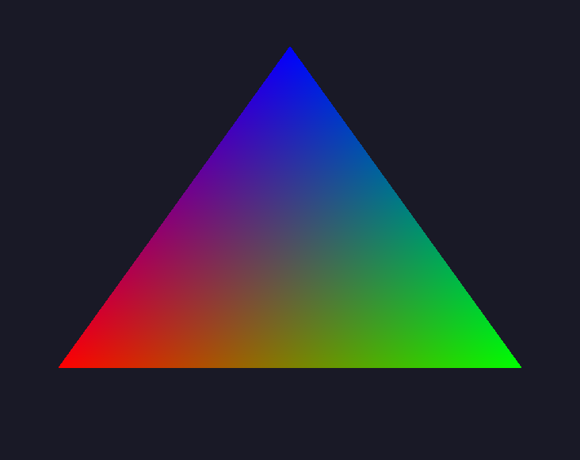
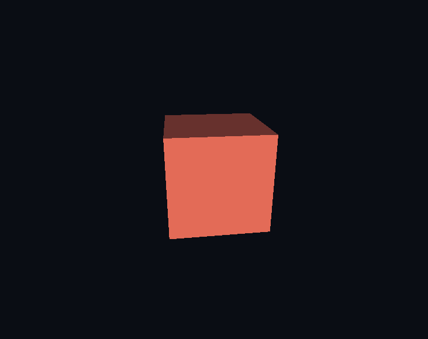

# Tutorial

Three programs, each corresponding to a layer. You only go as far as the first layer that accomplishes your task. The commented source files in the gallery show the same steps; here, the text explains each line.

Display prerequisites for layers 1 and 3: an OpenGL 4.5 core context, then call `compages::gpu::init`. The library does NOT open a window for you. See [Install.md](Install.md).

```cpp
#include <Compages/GPU/GPU.hpp>

if (auto ready = compages::gpu::init(glfwGetProcAddress); !ready)
{
    std::cerr << ready.error() << '\n';
    return 1;
}

// ... frames ...

compages::gpu::shutdown();
```

Here, `glfwGetProcAddress` is just an example. SDL and Qt each provide their own version.

---

## 1. A Triangle Named by the Shader

File: `examples/00_GettingStarted/01b_Triangle.cpp`
See also: [GPU.md](GPU.md).

The vertex shader declares two attributes: `position` and `color`. These are the only names that C++ needs to know.

```cpp
constexpr const char* VERTEX_SHADER = R"(#version 450 core
in vec2 position;
in vec3 color;
out vec3 vColor;
void main()
{
    vColor = color;
    gl_Position = vec4(position, 0.0, 1.0);
}
)";

constexpr const char* FRAGMENT_SHADER = R"(#version 450 core
in vec3 vColor;
out vec4 oColor;
void main()
{
    oColor = vec4(vColor, 1.0);
}
)";
```

```cpp
compages::gpu::Drawable triangle;

// Compilation may fail: the GLSL compiler log is passed back in the Result.
// COMPAGES_TRY just propagates that up to the caller.
COMPAGES_TRY(triangle.load(VERTEX_SHADER, FRAGMENT_SHADER));

// One value per vertex. Lists are interleaved in memory:
// position, color, position, color... This is fastest for the GPU to read.
triangle["position"] = { { -0.8f, -0.6f }, { 0.8f, -0.6f }, { 0.0f, 0.8f } };
triangle["color"]    = { { 1, 0, 0 }, { 0, 1, 0 }, { 0, 0, 1 } };

// Optional: detects an unknown name or wrong number of components
// now instead of at first draw call.
COMPAGES_TRY(triangle.prepare());
```

Per frame, simply:

```cpp
compages::gpu::clear({ 0.1f, 0.1f, 0.15f });
triangle.draw();   // flushes what has changed, then draws
```



If you write a wrong name or supply a `vec2` with three numbers, it won't crash with an exception on draw. The error is stored and includes a list of what the shader actually declares:

```cpp
const std::string err = compages::gpu::takeFrameError();
if (!err.empty())
    std::cerr << err << '\n';
```

When your vertices are already in a struct, the field names must match those in the shader. `01c_InterleavedTriangle` pushes the buffer once, as immutable usage, with no CPU copy:

```cpp
struct Vertex { Vector2f position; Vector3f color; };

compages::gpu::Buffer<Vertex> vertices;
COMPAGES_TRY_ASSIGN(vertices,
    compages::gpu::Buffer<Vertex>::from(corners,
        { .usage = compages::gpu::BufferUsage::Immutable, .cpu_mirror = false }));
triangle.vertices(vertices);
```

Remember: **the shader names things, C++ fills them, and `draw()` sends them.** The next step is `02_DynamicGeometry` (only the changed vertex is sent across) and then the scientific/compute chapter (`10_ScientificAndCompute/` - Game of Life, particles, galaxy).

---

## 2. A World Without Rendering

File: `examples/30_WorldAndAssets/30_HeadlessWorld.cpp`
See also: [World.md](World.md)

No need for `gpu::init` here. The container is `world::World`. An `Entity` is a chainable handle, not an object owning its children.

```cpp
#include <Compages/World/Entity.hpp>

struct Position { Vector3f value{ 0, 0, 0 }; };
struct Velocity { Vector3f value{ 0, 0, 0 }; };

compages::world::World world;

// The rock has a position but no velocity, so it is ignored below.
world.entity("player").set(Position{}).set(Velocity{ { 1, 0, 0 } });
world.entity("rock").set(Position{ { 0, 5, 0 } });

// Parent-child relationships are by name path: "Simulation/Worker".
compages::world::Entity root = world.entity("Simulation");
root.child("Worker");
```

A simulation step: `each` is the system; it only visits entities with **both** components. `update` runs behaviors, articulations, then world transforms. There are no behaviors here, but this is where you'd typically close out the step.

```cpp
compages::world::Frame step;
step.elapsed = 1.0f / 60.0f;

world.each<Position, Velocity>(
    [&](compages::world::Entity, Position& p, Velocity& v)
    { p.value += v.value * step.elapsed; });

world.update(step);

compages::world::Entity player = world.lookup("player");
```

Two clarifications to avoid confusion:

- The `Position` above is **your** struct. The place in the scene graph (what `.position(x, y, z)` modifies) is called the transform. Both can exist together. A simulation may use only one or both.
- The screen in `30_HeadlessWorld` is blank. The demo fails if the player hasn't moved. That's the check: Layer 2 is tested with zero pixels.

A behavior, for logic attached to an entity:

```cpp
struct Spin : compages::world::Behavior
{
    explicit Spin(float speed) : speed(speed) {}
    void update(float dt) override { transform().rotateY(speed * dt); }
    float speed;
};

ship.add<Spin>(1.0f);
```

An articulation, e.g. for an arm:

```cpp
using namespace units::literals;

compages::world::Entity arm = ship.child("Arm")
    .position(0, 0, 0.5f)
    .revolute({ 0, 0, 1 }, -90.0_deg, 90.0_deg);
arm.angle(30.0_deg);
```

`revolute` writes the local transform on the next `update`. You control the angle, the system sets the part's position, and children follow.

---

## 3. Showing the World

File: `examples/50_Complete/50_ThreeJsLike.cpp`
See also: [Renderer.md](Renderer.md)

```cpp
#include <Compages/Compages.hpp>

compages::world::World world;
compages::renderer::Scene scene(world);

scene.background(0.04f, 0.05f, 0.08f);
scene.camera().position(0.0f, 1.0f, 3.0f).add<compages::world::Orbit>();
scene.sun("Sun", { 1.0f, 0.95f, 0.85f }, 1.4f);

compages::world::Entity cube =
    scene.box("Cube", compages::renderer::color(0.9f, 0.18f, 0.12f));

COMPAGES_TRY(scene.prepare());
```



`box` returns an entity in the **world**. You rotate it just like any other entity, then a single call draws:

```cpp
void draw(compages::world::ViewFrame const& frame)
{
    cube.rotate(frame.elapsed, { 0.4f, 1.0f, 0.0f });
    scene.draw(frame);   // updates the world, then draws the image
}
```

`Orbit` reads the mouse via `ViewFrame`. A headless test passes only a `Frame` (no input); an interactive app passes a `ViewFrame`.

Different appearance, same primitive creation:

```cpp
scene.sphere("Ball", compages::renderer::color(1.0f, 0.3f, 0.2f));
scene.box("Crate", compages::renderer::texture("wooden-crate.jpg"));
```

Texture paths are searched in `external/Compages-data/` (and `external/Compages-data/` if you renamed the clone). You can override with the `COMPAGES_DATA_PATH` variable.

Two cameras, one world, one asset catalog:

```cpp
compages::renderer::Scene map(world, scene.assets());
compages::world::EntityId top = map.camera().id();

scene.update(frame);    // once
scene.render();         // active camera
map.render(top);        // the other view
```

That's the approach in `32a_SplitViews`.

---

## Which Header to Include

| Program | Include |
|---------|---------|
| Shader or compute only | `<Compages/GPU/GPU.hpp>` |
| Simulation, entities, `update` | `<Compages/World/World.hpp>` |
| Simulation with entity chaining `entity().child()` | `<Compages/World/Entity.hpp>` |
| Scene rendering | `<Compages/Compages.hpp>` |

Reference: [CheatSheet.md](CheatSheet.md).
